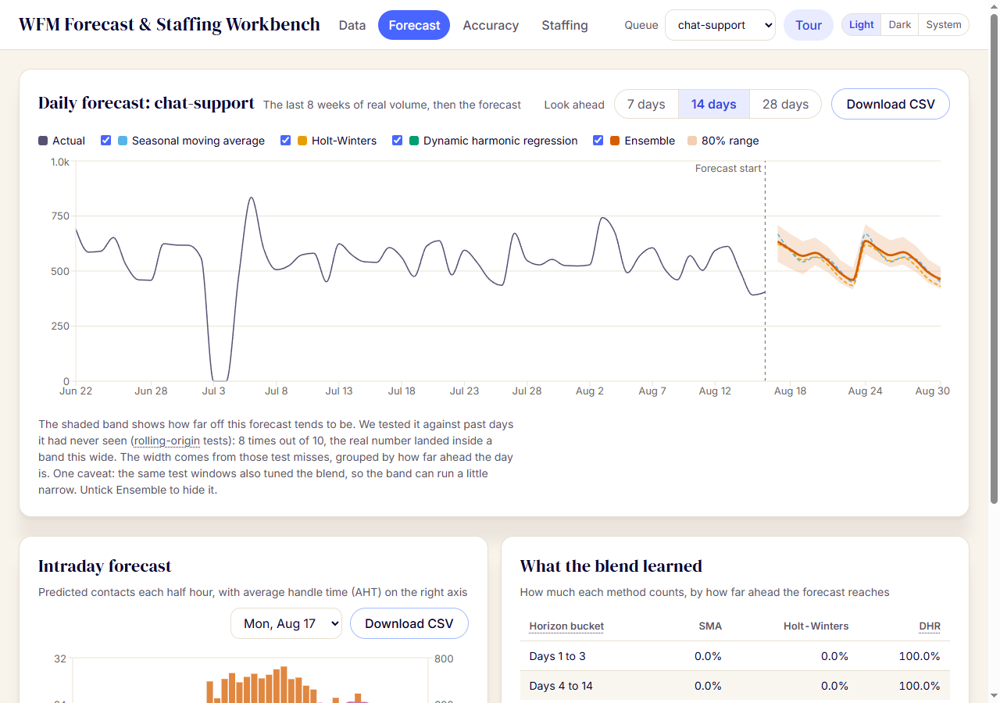

# WFM Forecast & Staffing Workbench

[](https://github.com/ryanportfolio/wfm/actions/workflows/ci.yml)
[](https://ryanportfolio.github.io/wfm/)
[](LICENSE)

**[Open the live demo](https://ryanportfolio.github.io/wfm/)**, then click "Load sample data". No install, no sign-up, no backend.

A contact center workforce management tool: forecast interval-level contact volume with comparable methods, prove accuracy with rolling-origin backtests, convert the forecast to interval staffing through Erlang A or Erlang C, and test what-if scenarios live.

Built by Ryan Allen (WFM senior team lead; Verint tenant admin). Runs fully in the browser: no backend, no data leaves the machine.



## Run it

```bash
npm install
npm run dev
```

Open http://localhost:5173, click "Load sample data" (2 years, 3 queues, 30-minute intervals), and walk the tabs left to right. `npm run build` produces a static site; `npm test` runs the suite.

## What it does

**Data.** Bundled sample program (two voice queues plus chat, public-sector shape: Monday peaks, benefit-cycle bumps, holiday closures, injected outages) or your own CSV with columns `timestamp,queue,offered,aht`, one row per interval:

```csv
timestamp,queue,offered,aht
2026-01-05T08:00,voice-support,42,415
2026-01-05T08:30,voice-support,51,402
2026-01-05T09:00,voice-support,58,398
```

Duplicate queue/timestamp rows reject the entire file, including equivalent timestamps with omitted zero seconds. Other invalid rows are listed and skipped; valid rows load. Contact counts and AHT must be finite, nonnegative numbers, and positive demand needs positive AHT. Review row errors before using the results.

The completeness report separates missing dates, missing expected slots and explicit zero rows for every queue. Expected slots are inferred from repeated weekday history, so gaps may be closures or missing data. The forecast still fills absent calendar days with zero and uses available interval records; resolve unexplained gaps before planning. MAD-based outlier cleaning lists each flagged point and replacement.

**Forecast.** Three component methods plus a custom ensemble, all hand-implemented in TypeScript:

- Seasonal moving average: trimmed, recency-weighted same-weekday average (the long-horizon benchmark the literature says is hard to beat).
- Holt-Winters: additive, weekly seasonality, grid-searched smoothing parameters.
- Dynamic harmonic regression: ridge regression on weekly and yearly Fourier terms, trend, weekday, holiday, post-holiday, and month-start features.
- Ensemble: blends the three with weights proportional to inverse WAPE raised to a power picked from a small grid, fitted per horizon bucket (1-3, 4-14, 15-28 days) on non-overlapping rolling-origin folds inside the training window and scored against raw actuals, the same way the backtest judges the final forecast. The fitted weights are shown in the UI.

Daily forecasts are spread to 30-minute intervals with recency-weighted day-of-week profiles learned from cleaned history. The daily chart shades an 80% prediction range around the ensemble, calibrated from the empirical errors of the same rolling-origin evaluation that fits the blend weights.

**Accuracy.** Rolling-origin backtest (8 folds, 28-day horizon, re-cleaned and re-fit per fold so nothing leaks), scored as WAPE, MAPE, and bias at interval, daily, and weekly grain. The scorecard includes an equal-weight blend row as a benchmark, so the fitted ensemble weights have to prove they beat the naive average. Sample-data result for the largest queue, daily WAPE: seasonal average 11.2%, Holt-Winters 11.3%, harmonic regression 7.9%, equal-weight blend 9.5%, ensemble 8.1%. The scorecard renders whatever the loaded data says, including when a single component beats the ensemble: on this data the harmonic regression still edges the ensemble by 0.15 points.

**Staffing.** Interval requirements via Erlang C or Erlang A (abandonment-aware; the birth-death solve was validated against an independent 400k-arrival Monte Carlo simulation to within 0.3pp on service level). Levers: SL target, patience, abandonment cap, shrinkage (applied as division, the correct way), occupancy cap, chat concurrency, volume and AHT deltas. Scenario B comparison shows the FTE-hour and occupancy deltas per day. A fixed-staff ("what I have") mode projects SL, ASA, and abandonment at the heads you enter instead of solving for a target, flagging the intervals that miss. An optional cost-per-hour rate prices scheduled FTE-hours.

**Capacity.** Compare a no-hire baseline with one hiring class across 13 weeks for the selected queue. Enter starting paid headcount, weekly attrition, paid hours, shrinkage, hourly cost, training and ramp. Demand is productive FTE: required on-contact hours divided by paid hours per week. Supply applies shrinkage once. The chart, table and CSV show required versus available FTE, shortages and paid cost.

Use "Seed demand from selected forecast" to convert complete seven-day blocks of default staffing need (Erlang A, 80% in 20 seconds, 120-second patience, 90% occupancy cap; two concurrent chats for chat queues). The last complete week repeats through week 13, labeled as an editable assumption. Seeding is explicit; later scenario changes do not rewrite the plan.

"Load illustrative hiring example" starts with 100 heads, 20% shrinkage and 40 paid hours: demand rises from 78 to 84 FTE in week 7. A 10-person class starts in week 2, trains for two weeks, then ramps over two weeks. The baseline first falls short in week 7; the proposal covers all 13 weeks. Each queue keeps its own plan.

**Intraday.** Choose a forecast day and an "Observed through" boundary. Fill every elapsed interval's actual contacts, including real zeros; blank means missing. Remaining demand scales by elapsed actuals divided by elapsed baseline. With no observed baseline, remaining demand stays at baseline and the interface explains why. Enter scheduled heads by interval to compare baseline and revised required bodies and projected service level. Staffing uses scenario A's AHT, shrinkage, concurrency and service assumptions; its volume delta does not alter the original baseline.

Intraday supports up to 48 half-hour intervals starting at :00 or :30, 100,000 contacts, 500 scheduled heads and 100 Erlangs per interval. A worker stops jobs after 10 seconds. Staffing and fixed-staff projections support up to 1,000 Erlangs and 2,000 on-contact agents per interval. Erlang A also limits each solve to 5 million waiting-phase updates, with a bounded-error shortcut for negligible late-service probability; see [model limits](docs/design.md). Unsupported assumptions produce an error. Check contact counts, concurrency, and AHT, patience and answer target in seconds if a limit is reached. Each interval uses steady-state queue math; waiting callers do not carry into the next interval.

**Named projects.** Name the working plan and choose "Save project" to download JSON. "Open project" restores all interval history, selected queue and horizon, staffing A/B and cost settings, each queue's capacity plan, and intraday inputs by queue/day. Version 1 files open with empty intraday inputs; current files use version 2. Invalid or unsupported files leave current work intact. Project files are local downloads, with no automatic upload or autosave.

Save before closing the page. Loading replacement CSV or sample data clears capacity and intraday plans.

**Working with results.** Forecast, scorecard, staffing, capacity and intraday tables download as CSV. Staffing scenario settings encode into the URL hash, so a what-if is shareable as a link; links do not contain data, capacity plans or intraday inputs. An opened project takes precedence over initial link settings. Forecasts, backtests, and staffing solves run in a Web Worker to keep the sliders responsive, and a header toggle switches between light, dark, and system theme.


## Why these methods

Research notes with sources are in [docs/research.md](docs/research.md): Taylor 2008 on which classical methods win at which horizons, the forecast-combination evidence, Erlang A vs C, pooling math, and the accuracy-metric tradeoffs. The design rationale (stack, data model, algorithm spec) is in [docs/design.md](docs/design.md).

## Roadmap

Forecast/staffing, the one-queue capacity planner, named projects and intraday reforecast are implemented. Queue strategy analysis (pooled versus split queues) remains future work. Scope and limitations are in [docs/design.md](docs/design.md#module-roadmap).

## Stack

Vite, React, TypeScript, Recharts. All forecasting and queueing math lives in [src/engine](src/engine) as dependency-free pure functions with Vitest coverage, including Erlang B/C/A against published table values.

## License

MIT, see [LICENSE](LICENSE). The agent-harness files under `.claude/`, `.agents/`
and `.codex/` are template tooling rather than project source; some carry their
own terms, listed in [NOTICE](NOTICE).
