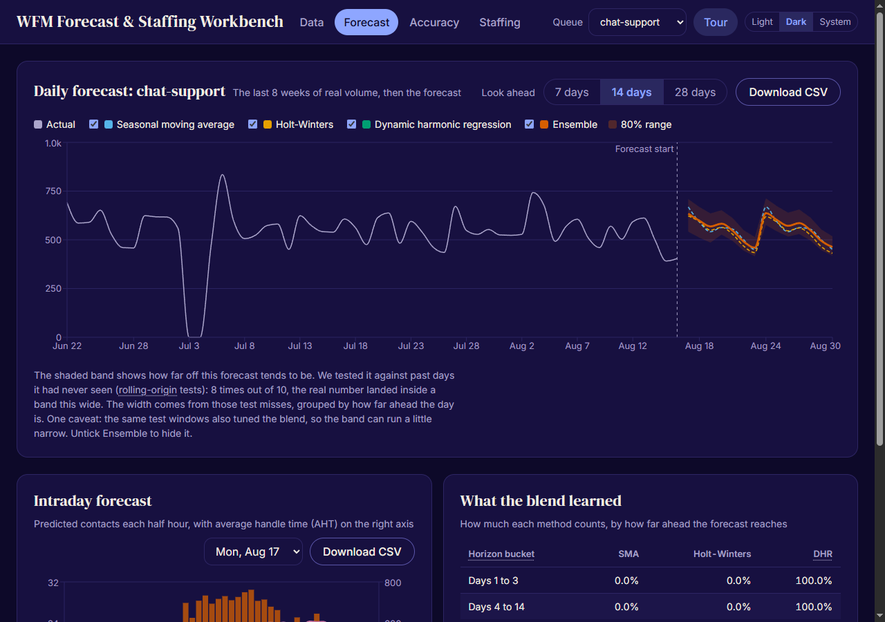
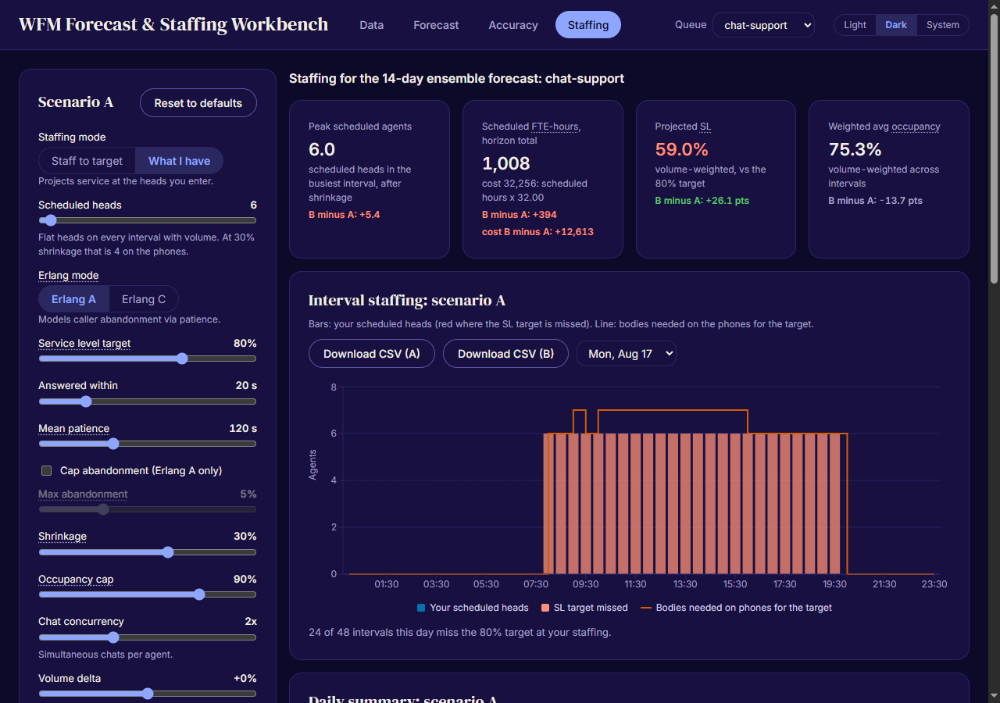

# WFM Forecast & Staffing Workbench

[](https://github.com/ryanportfolio/wfm/actions/workflows/ci.yml)
[](https://ryanportfolio.github.io/wfm/)
[](LICENSE)

**[Open the live demo](https://ryanportfolio.github.io/wfm/)**, then click "Load sample data". No install, no sign-up, no backend.

A contact center workforce management tool: forecast interval-level contact volume with comparable methods, prove accuracy with rolling-origin backtests, convert the forecast to interval staffing through Erlang A or Erlang C, and test what-if scenarios live.

Built by Ryan Allen (WFM senior team lead; Verint tenant admin). Runs fully in the browser: no backend, no data leaves the machine.



## Run it

```bash
npm install
npm run dev
```

Open http://localhost:5173, click "Load sample data" (2 years, 3 queues, 30-minute intervals), and walk the tabs left to right. `npm run build` produces a static site; `npm test` runs the 117-test suite.

## What it does

**Data.** Bundled sample program (two voice queues plus chat, public-sector shape: Monday peaks, benefit-cycle bumps, holiday closures, injected outages) or your own CSV with columns `timestamp,queue,offered,aht`. MAD-based outlier cleaning runs before any model sees the data, and the flagged points are listed, not hidden.

**Forecast.** Three component methods plus a custom ensemble, all hand-implemented in TypeScript:

- Seasonal moving average: trimmed, recency-weighted same-weekday average (the long-horizon benchmark the literature says is hard to beat).
- Holt-Winters: additive, weekly seasonality, grid-searched smoothing parameters.
- Dynamic harmonic regression: ridge regression on weekly and yearly Fourier terms, trend, weekday, holiday, post-holiday, and month-start features.
- Ensemble: blends the three with weights proportional to inverse WAPE raised to a power picked from a small grid, fitted per horizon bucket (1-3, 4-14, 15-28 days) on non-overlapping rolling-origin folds inside the training window and scored against raw actuals, the same way the backtest judges the final forecast. The fitted weights are shown in the UI.

Daily forecasts are spread to 30-minute intervals with recency-weighted day-of-week profiles learned from cleaned history.

**Accuracy.** Rolling-origin backtest (8 folds, 28-day horizon, re-cleaned and re-fit per fold so nothing leaks), scored as WAPE, MAPE, and bias at interval, daily, and weekly grain. The scorecard includes an equal-weight blend row as a benchmark, so the fitted ensemble weights have to prove they beat the naive average. Sample-data result for the largest queue, daily WAPE: seasonal average 11.2%, Holt-Winters 11.3%, harmonic regression 7.9%, equal-weight blend 9.5%, ensemble 8.1%. The scorecard renders whatever the loaded data says, including when a single component beats the ensemble: on this data the harmonic regression still edges the ensemble by 0.15 points.

**Staffing.** Interval requirements via Erlang C or Erlang A (abandonment-aware; the birth-death solve was validated against an independent 400k-arrival Monte Carlo simulation to within 0.3pp on service level). Levers: SL target, patience, abandonment cap, shrinkage (applied as division, the correct way), occupancy cap, chat concurrency, volume and AHT deltas. Scenario B comparison shows the FTE-hour and occupancy deltas per day.



## Why these methods

Research notes with sources are in [docs/research.md](docs/research.md): Taylor 2008 on which classical methods win at which horizons, the forecast-combination evidence, Erlang A vs C, pooling math, and the accuracy-metric tradeoffs. The design rationale (stack, data model, algorithm spec) is in [docs/design.md](docs/design.md).

## Roadmap

1. Forecast + staffing engine (this release).
2. Capacity planner: weekly FTE walk with attrition, hire classes, and ramp.
3. Queue strategy analyzer: pooled vs split staffing comparison, arrival correlation, mix-factor stress.
4. Intraday reforecast simulator: morning-actuals ratio reforecasting and skill-move what-ifs.

## Stack

Vite, React, TypeScript, Recharts. All forecasting and queueing math lives in [src/engine](src/engine) as dependency-free pure functions with Vitest coverage, including Erlang B/C/A against published table values.

## License

MIT, see [LICENSE](LICENSE). The agent-harness files under `.claude/`, `.agents/`
and `.codex/` are template tooling rather than project source; some carry their
own terms, listed in [NOTICE](NOTICE).
